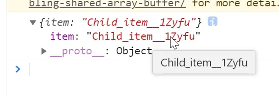
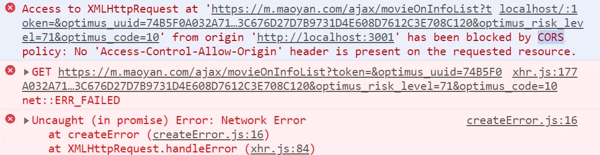
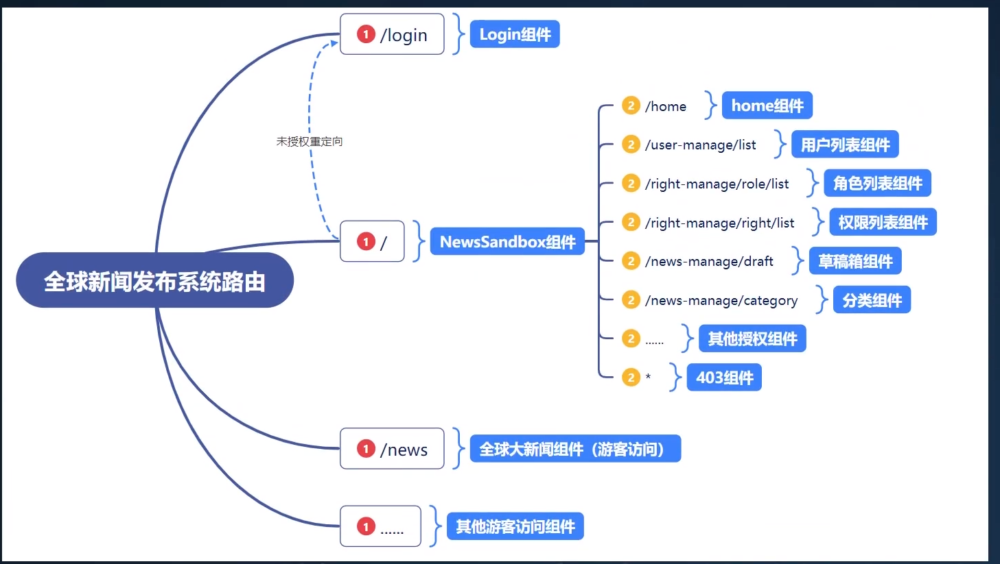

+ #### `样式.module.css`：

  + 在`.css`文件后缀名改成`.module.css`

  + 模块化CSS对于我们的标签选择器没有作用，不能直接堆标签进行样式编辑，所以应当选择id和class选择器

  + 对于引入也不同于普通的引入。

    ```jsx
    import style from './Name.module.css'
    
    console.log(style)
    
    export default function Child() {
        return (
        	<li className={style.item}>11111</li>
        )
    }
    ```

    

    ```css
    // 样式文件.module.css
    .item {
        样式
    }
    ```

+ #### `yarn add sass -s`

+ #### `yarn add axios -S`

+ #### 解决跨域和反向代理

  + 跨域报错，违反了同源策略

    
    
  + `Proxying in Development`
  
    + `yarn add http-proxy-middleware -D`这是开发时需要的库,或写成`npm install --save-dev http-proxy-middleware`
  
    + 在`src`下新建`setupProxy.js`
  
      ```js
      const { createProxyMiddleware } = require('http-proxy-middleware');
      
      module.exports = function (app) {
          app.use(
              // 当你遇到这个的请求名的时候，就会在下面的目标中进行网络请求
              '/api',
              createProxyMiddleware({
                  // 下面是你要代理的域名
                  target: 'http://localhost:5000',
                  changeOrigin: true,
              })
          );
      
          // 代理多个就多写几次
          // app.use(
          //     '/api',
          //     createProxyMiddleware({
          //         target: 'http://localhost:5000',
          //         changeOrigin: true,
          //     })
          // );
      };
      ```
  
    + 重启项目
  
+ #### 路由架构

  

  + `yarn add react-router-dom -S`

  + 注意我们的路由是属于模糊匹配的。而且直接使用`<Route path='' component={} >`会进行多个的匹配。因此我们需要对它进行一个组件包裹`Switch`组件包裹，见名知意，`Switch`表示按顺序匹配到一个就不继续匹配了。

    + 注意我们的react-route-domV5和V6版本是有差异的

    + `Switch`被替换成了`Routes`

    + `Route`属性中`component={组件}`修改成了`element={<组件 />}`

    + 具体变化:

      + `https://blog.csdn.net/weixin_47091394/article/details/121772779`

      + `https://segmentfault.com/a/1190000039190541`

      + `https://v5.reactrouter.com/web/api/Route/component`

    + 为了项目统一，暂时先用V5版本。

+ #### `antd`

  + `yarn add antd -S`。
  + `antd`旧的版本需要安装一下插件，按需打包。现在的版本已经实现按需打包。

+ #### withRouter

  + 我们在开发中不是通过路由切换过来的子组件说明父级没有做对于它的路由跳转，也就props没有路由相关属性

  + 把不是通过路由切换过来的组件中，将react-router 的 history、location、match 三个对象传入props对象上

    ```jsx
    import React,{Component} from 'react'
    import {Switch,Route,NavLink,Redirect,withRouter} from 'react-router-dom' //引入withRouter
    import One from './One'
    import NotFound from './NotFound'
    class App extends Component{
        //此时才能获取this.props,包含（history, match, location）三个对象
        console.log(this.props);  //输出{match: {…}, location: {…}, history: {…}, 等}
        render(){return (<div className='app'>
                <NavLink to='/one/users'>用户列表</NavLink>
                <NavLink to='/one/companies'>公司列表</NavLink>
                <Switch>
                    <Route path='/one/:type?' component={One} />
                    <Redirect from='/' to='/one' exact />
                    <Route component={NotFound} />
                </Switch>
            </div>)
        }
    }
    // 把App传入到withRoute，这时App的props就有路由的基本属性
    export default withRouter(App)
    ```

+ #### 列表技巧

  ```js
  ...
  function SideMenu(props) {
  
    // 下面menuList只是一个形参名
    const renderMenu = (menuList)=>{
      return menuList.map(item=>{
        // 假如我们的菜单有子菜单返回SubMenu，没有就Menu.Item
        if(item.children){
          return <SubMenu key={item.key} icon={item.icon} title={item.title}>
             // 每次遍历的时候顺便把我们的子菜单名一起渲染出来
             { renderMenu(item.children) }
          </SubMenu>
        }
  
        return <Menu.Item key={item.key} icon={item.icon} onClick={()=>{
          //  console.log(props)
          props.history.push(item.key)
        }}>{item.title}</Menu.Item>
      })
    }
    return (
      <Sider trigger={null} collapsible collapsed={false}>
        <div className="logo" >全球新闻发布管理系统</div>
        <Menu theme="dark" mode="inline" defaultSelectedKeys={['3']}>
            {renderMenu(menuList)}
        </Menu>
      </Sider>
    )
  }
  // 我们的子菜单想要完成路由跳转就需要被withRouter包裹
  export default withRouter(SideMenu)
  ```

+ #### json-server

  + `npm install -g json-server`

  + 创建json文件

  + 启动`json-server --watch ./test.json --port 8000`

  + 打开`loaclhost:8000`

  + `json-server`配置好允许所有访问，解决了跨域问题。`Access-Control-Allow-Origin`

    ```js
     const ajax = ()=>{
    
            // id获取到对应id数据
            // http://localhost:8000/posts/:id 
    
            //取数据  get
            // axios.get("http://localhost:8000/posts/2").then(res=>{
            //     console.log(res.data)
            // })
    
            // 增  post id自增长
            // axios.post("http://localhost:8000/posts",{
            //     title:"33333",
            //     author:"xiaoming"
            // })
    
            // 更新 put 全部替换
            // axios.put("http://localhost:8000/posts/1",{
            //     title:"1111-修改"
            // })
    
            // 更新 patch 局部更新
            // axios.patch("http://localhost:8000/posts/1",{
            //     title:"1111-修改-11111"
            // }) 
    
            // 删除  delete
            // axios.delete("http://localhost:8000/posts/1")
        
            // _embed 获取相关联的表，固定拼接?_embed=想要相关联的数据库表名（json中应该算是对象）
            // axios.get("http://localhost:8000/posts?_embed=comments").then(res=>{
            //     console.log(res.data)
            // })
    
            // _expand 根据关联的id向上查找
            // axios.get("http://localhost:8000/comments?_expand=post").then(res=>{
            //     console.log(res.data)
            // })
        }
    ```

    ```json
    {
      "posts": [
        {
          "id": 1,
          "title": "1111-修改-11111",
          "author": "kerwin"
        },
        ...
      ],
      "comments": [
        {
          "id": 1,
          "body": "11111-comment",
          "postId": 1
        },
        ...
      ]
    }
    ```

    + 注意的细节就是`_expand=post`，id名是固定的方式的，我们的`comments`中根据`postId`找到`posts`表
    + 加入我们修改posts表名为names，则关联id应该改名为`nameId`，我们的`_expand=post`改为`_expand=name`。这是一种固定格式。

+ #### 关于对象的小技巧

  + 可以把字符串作为key。这样我们可以把路由的路径字符串作为key，然后根据路由变化，键值对中对应路由值显示出来。算是一个小技巧而已。

    ```jsx
    const iconList = {
      "/home":<UserOutlined />,
      "/user-manage":<UserOutlined />,
      "/user-manage/list":<UserOutlined />,
      "/right-manage":<UserOutlined />,
      "/right-manage/role/list":<UserOutlined />,
      "/right-manage/right/list":<UserOutlined />
      //.......
    }
    
    // 后端将路由作为item.key发出
    // iconList[item.key]找到对应图片
    return menuList.map(item=>{
          if(item.children && checkPagePermission(item)){
            return <SubMenu key={item.key} icon={iconList[item.key]} title={item.title}>
               { renderMenu(item.children) }
            </SubMenu>
          }
    
          return checkPagePermission(item) && <Menu.Item key={item.key} icon={iconList[item.key]}  onClick={()=>{
            //  console.log(props)
            props.history.push(item.key)
          }}>{item.title}</Menu.Item>
        })
    ```

+ #### 项目中关于判断的小技巧

  ```js
  return menuList.map(item=>{
        // 注意item.children为undefined。利用长度来决定是否为父菜单，不是父菜单就不会有下标图标
        if(item.children?.length>0 && checkPagePermission(item)){
          return <SubMenu key={item.key} icon={iconList[item.key]} title={item.title}>
             { renderMenu(item.children) }
          </SubMenu>
        }
  ```

+ #### 让菜单栏单独滚动技巧

  ```js
  <Sider trigger={null} collapsible collapsed={false} >
        // 1. 用一个div包裹，变成一个flex布局，然后高度100%，方向垂直 
        <div style={{display:"flex",height:"100%","flexDirection":"column"}}>
          <div className="logo" >全球新闻发布管理系统</div>
  		// 菜单栏设置长度铺满，一旦展开子菜单超出100%就会出现滚动条
          <div style={{flex:1,"overflow":"auto"}}>
            <Menu theme="dark" mode="inline" selectedKeys={selectKeys} className="aaaaaaa" defaultOpenKeys={openKeys}>
                {renderMenu(meun)}
            </Menu>
          </div>
        </div>
  </Sider>
  ```

+ #### 菜单栏根据路由动态高亮

  + 利用`defaultSelectKeys`就是选中高亮，`defaultOpenKeys`打开到子菜单栏，这个穿的是父菜单栏的路由，就是上一级，所以要做判断是否有上一级，并split
  + 在我们打开页面的时候，可能路由会发生跳转，动态改变了路由，但是我们的`defaultSelectKeys`是非受控属性，以为不能动态变化，替换成`selectedKeys`

  ```jsx
  const selectKeys = [props.location.pathname]
  const openKeys = ["/"+props.location.pathname.split("/")[1]]
  
  
  <Menu theme="dark" mode="inline" selectedKeys={selectKeys} className="aaaaaaa" defaultOpenKeys={openKeys}>
                {renderMenu(meun)}
            </Menu>
  ```

  + 假设路由为`/user-mange/list`
    + `"/user-mange/list".split("/")`得到数组`['', "user-mange", "list"]`
    + 然后取数组第一项就是`/user-mange/list".split("/")[1]`就是`"user-mange"`
  + 受控组件
    + 能够根据外部状态改变。

+ #### Table组件开发

  + `columns`表示列，有`title`，`datatIndex`这里传入的值是为了和`dataSource`中的key进行匹配。有自己单独的`key`值是可选的 。
  + 所以在开发中，如果传入的`datatIndex`需要交涉好，传入的`dataSource`有对应的key。
  + 我们希望我们的`dataSource`是动态的，所以应该传入一个`state`。
