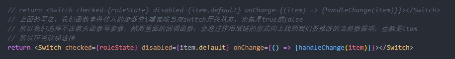
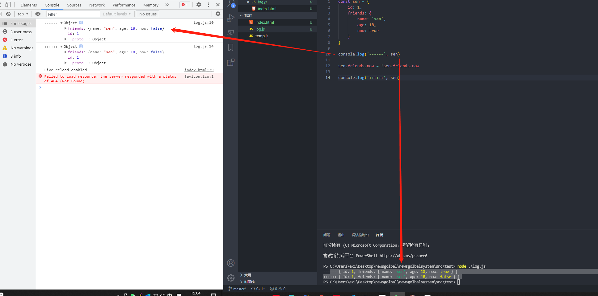

+ #### `样式.module.css`：

  + 在`.css`文件后缀名改成`.module.css`

  + 模块化CSS对于我们的标签选择器没有作用，不能直接堆标签进行样式编辑，所以应当选择id和class选择器

  + 对于引入也不同于普通的引入。

    ```jsx
    import style from './Name.module.css'
    
    console.log(style)
    
    export default function Child() {
        return (
        	<li className={style.item}>11111</li>
        )
    }
    ```

    

    ```css
    // 样式文件.module.css
    .item {
        样式
    }
    ```

+ #### `yarn add sass -s`

+ #### `yarn add axios -S`

+ #### 解决跨域和反向代理

  + 跨域报错，违反了同源策略

    
    
  + `Proxying in Development`
  
    + `yarn add http-proxy-middleware -D`这是开发时需要的库,或写成`npm install --save-dev http-proxy-middleware`
  
    + 在`src`下新建`setupProxy.js`
  
      ```js
      const { createProxyMiddleware } = require('http-proxy-middleware');
      
      module.exports = function (app) {
          app.use(
              // 当你遇到这个的请求名的时候，就会在下面的目标中进行网络请求
              '/api',
              createProxyMiddleware({
                  // 下面是你要代理的域名
                  target: 'http://localhost:5000',
                  changeOrigin: true,
              })
          );
      
          // 代理多个就多写几次
          // app.use(
          //     '/api',
          //     createProxyMiddleware({
          //         target: 'http://localhost:5000',
          //         changeOrigin: true,
          //     })
          // );
      };
      ```
  
    + 重启项目
  
+ #### 路由架构

  

  + `yarn add react-router-dom -S`

  + 注意我们的路由是属于模糊匹配的。而且直接使用`<Route path='' component={} >`会进行多个的匹配。因此我们需要对它进行一个组件包裹`Switch`组件包裹，见名知意，`Switch`表示按顺序匹配到一个就不继续匹配了。

    + 注意我们的react-route-domV5和V6版本是有差异的
    + `Switch`被替换成了`Routes`
    + `Route`属性中`component={组件}`修改成了`element={<组件 />}`
    + 具体变化:
    
      + `https://blog.csdn.net/weixin_47091394/article/details/121772779`
    
      + `https://segmentfault.com/a/1190000039190541`
    
      + `https://v5.reactrouter.com/web/api/Route/component`
    + 为了项目统一，暂时先用V5版本。

  ```js
   <Switch>
                          <Route path="/home" component={Home} />
                          <Route path="/user-manage/list" component={UserList} />
                          <Route path="/right-manage/role/list" component={RoleList} />
                          <Route path="/right-manage/right/list" component={RightList} />
                          {/* Redirect必须放在Switch最后一行 */}
                          {/* 由于是模糊匹配，如果上面都匹配不到，只要带斜杆的就一定能匹配到下面这个 */}
                          {/* <Redirect from='/' to='/home'/> */}
                          {/* 如果我们想要精确匹配的时候，加入exact */}
                          <Redirect from="/" to="/home" exact />
                          {/* *表示全部匹配。应该放到最后一行，用于最后显示所有匹配失败显示404 */}
  
                          <Route path="*" component={Nopermission} />
                      </Switch>
  ```

  ```js
  
  export default function IndexRouter() {
      return (
          <HashRouter>
              <Switch>
                  <Route path='/login' component={Login} />
                  {/* <Route path='/' render={() => { return (localStorage.getItem('token')?<NewsSandBox></NewsSandBox>:<Redirect to = "/login" />) }} /> */}
                  {/* 等价于 */}
                  <Route path="/" render={()=>localStorage.getItem("token")? <NewsSandBox></NewsSandBox>:<Redirect to="/login"/> }/>
              </Switch>
          </HashRouter>
      )
  }
  ```

+ #### `antd`

  + `yarn add antd -S`。
  + `antd`旧的版本需要安装一下插件，按需打包。现在的版本已经实现按需打包。

+ #### withRouter

  + 我们在开发中不是通过路由切换过来的子组件说明父级没有做对于它的路由跳转，也就props没有路由相关属性

  + 把不是通过路由切换过来的组件中，将react-router 的 history、location、match 三个对象传入props对象上

    ```jsx
    import React,{Component} from 'react'
    import {Switch,Route,NavLink,Redirect,withRouter} from 'react-router-dom' //引入withRouter
    import One from './One'
    import NotFound from './NotFound'
    class App extends Component{
        //此时才能获取this.props,包含（history, match, location）三个对象
        console.log(this.props);  //输出{match: {…}, location: {…}, history: {…}, 等}
        render(){return (<div className='app'>
                <NavLink to='/one/users'>用户列表</NavLink>
                <NavLink to='/one/companies'>公司列表</NavLink>
                <Switch>
                    <Route path='/one/:type?' component={One} />
                    <Redirect from='/' to='/one' exact />
                    <Route component={NotFound} />
                </Switch>
            </div>)
        }
    }
    // 把App传入到withRoute，这时App的props就有路由的基本属性
    export default withRouter(App)
    ```

+ #### 列表技巧

  ```js
  ...
  function SideMenu(props) {
  
    // 下面menuList只是一个形参名
    const renderMenu = (menuList)=>{
      return menuList.map(item=>{
        // 假如我们的菜单有子菜单返回SubMenu，没有就Menu.Item
        if(item.children){
          return <SubMenu key={item.key} icon={item.icon} title={item.title}>
             // 每次遍历的时候顺便把我们的子菜单名一起渲染出来
             { renderMenu(item.children) }
          </SubMenu>
        }
  
        return <Menu.Item key={item.key} icon={item.icon} onClick={()=>{
          //  console.log(props)
          props.history.push(item.key)
        }}>{item.title}</Menu.Item>
      })
    }
    return (
      <Sider trigger={null} collapsible collapsed={false}>
        <div className="logo" >全球新闻发布管理系统</div>
        <Menu theme="dark" mode="inline" defaultSelectedKeys={['3']}>
            {renderMenu(menuList)}
        </Menu>
      </Sider>
    )
  }
  // 我们的子菜单想要完成路由跳转就需要被withRouter包裹
  export default withRouter(SideMenu)
  ```

+ #### json-server

  + `npm install -g json-server`

  + 创建json文件

  + 启动`json-server --watch ./test.json --port 8000`

  + 打开`loaclhost:8000`

  + `json-server`配置好允许所有访问，解决了跨域问题。`Access-Control-Allow-Origin`

    ```js
     const ajax = ()=>{
    
            // id获取到对应id数据
            // http://localhost:8000/posts/:id 
    
            //取数据  get
            // axios.get("http://localhost:8000/posts/2").then(res=>{
            //     console.log(res.data)
            // })
    
            // 增  post id自增长
            // axios.post("http://localhost:8000/posts",{
            //     title:"33333",
            //     author:"xiaoming"
            // })
    
            // 更新 put 全部替换
            // axios.put("http://localhost:8000/posts/1",{
            //     title:"1111-修改"
            // })
    
            // 更新 patch 局部更新
            // axios.patch("http://localhost:8000/posts/1",{
            //     title:"1111-修改-11111"
            // }) 
    
            // 删除  delete
            // axios.delete("http://localhost:8000/posts/1")
        
            // _embed 获取相关联的表，固定拼接?_embed=想要相关联的数据库表名（json中应该算是对象）
            // axios.get("http://localhost:8000/posts?_embed=comments").then(res=>{
            //     console.log(res.data)
            // })
    
            // _expand 根据关联的id向上查找
            // axios.get("http://localhost:8000/comments?_expand=post").then(res=>{
            //     console.log(res.data)
            // })
        }
    ```

    ```json
    {
      "posts": [
        {
          "id": 1,
          "title": "1111-修改-11111",
          "author": "kerwin"
        },
        ...
      ],
      "comments": [
        {
          "id": 1,
          "body": "11111-comment",
          "postId": 1
        },
        ...
      ]
    }
    ```

    + 注意的细节就是`_expand=post`，id名是固定的方式的，我们的`comments`中根据`postId`找到`posts`表
    + 加入我们修改posts表名为names，则关联id应该改名为`nameId`，我们的`_expand=post`改为`_expand=name`。这是一种固定格式。

+ #### 关于对象的小技巧

  + 可以把字符串作为key。这样我们可以把路由的路径字符串作为key，然后根据路由变化，键值对中对应路由值显示出来。算是一个小技巧而已。

    ```jsx
    const iconList = {
      "/home":<UserOutlined />,
      "/user-manage":<UserOutlined />,
      "/user-manage/list":<UserOutlined />,
      "/right-manage":<UserOutlined />,
      "/right-manage/role/list":<UserOutlined />,
      "/right-manage/right/list":<UserOutlined />
      //.......
    }
    
    // 后端将路由作为item.key发出
    // iconList[item.key]找到对应图片
    return menuList.map(item=>{
          if(item.children && checkPagePermission(item)){
            return <SubMenu key={item.key} icon={iconList[item.key]} title={item.title}>
               { renderMenu(item.children) }
            </SubMenu>
          }
    
          return checkPagePermission(item) && <Menu.Item key={item.key} icon={iconList[item.key]}  onClick={()=>{
            //  console.log(props)
            props.history.push(item.key)
          }}>{item.title}</Menu.Item>
        })
    ```

+ #### 项目中关于判断的小技巧

  ```js
  return menuList.map(item=>{
        // 注意item.children为undefined。利用长度来决定是否为父菜单，不是父菜单就不会有下标图标
        if(item.children?.length>0 && checkPagePermission(item)){
          return <SubMenu key={item.key} icon={iconList[item.key]} title={item.title}>
             { renderMenu(item.children) }
          </SubMenu>
        }
  ```

+ #### 让菜单栏单独滚动技巧

  ```js
  <Sider trigger={null} collapsible collapsed={false} >
        // 1. 用一个div包裹，变成一个flex布局，然后高度100%，方向垂直 
        <div style={{display:"flex",height:"100%","flexDirection":"column"}}>
          <div className="logo" >全球新闻发布管理系统</div>
  		// 菜单栏设置长度铺满，一旦展开子菜单超出100%就会出现滚动条
          <div style={{flex:1,"overflow":"auto"}}>
            <Menu theme="dark" mode="inline" selectedKeys={selectKeys} className="aaaaaaa" defaultOpenKeys={openKeys}>
                {renderMenu(meun)}
            </Menu>
          </div>
        </div>
  </Sider>
  ```

+ #### 菜单栏根据路由动态高亮

  + 利用`defaultSelectKeys`就是选中高亮，`defaultOpenKeys`打开到子菜单栏，这个穿的是父菜单栏的路由，就是上一级，所以要做判断是否有上一级，并split
  + 在我们打开页面的时候，可能路由会发生跳转，动态改变了路由，但是我们的`defaultSelectKeys`是非受控属性，以为不能动态变化，替换成`selectedKeys`

  ```jsx
  const selectKeys = [props.location.pathname]
  const openKeys = ["/"+props.location.pathname.split("/")[1]]
  
  
  <Menu theme="dark" mode="inline" selectedKeys={selectKeys} className="aaaaaaa" defaultOpenKeys={openKeys}>
                {renderMenu(meun)}
            </Menu>
  ```

  + 假设路由为`/user-mange/list`
    + `"/user-mange/list".split("/")`得到数组`['', "user-mange", "list"]`
    + 然后取数组第一项就是`/user-mange/list".split("/")[1]`就是`"user-mange"`
  + 受控组件
    + 能够根据外部状态改变。

+ #### Table组件开发

  + `columns`表示列，有`title`，`datatIndex`这里传入的值是为了和`dataSource`中的key进行匹配。有自己单独的`key`值是可选的 ，`render`属性可选，用于渲染组件等等，值为一个函数，这样做可以给这一列数据添加样式等等。或者渲染一个组件等等。
  + 所以在开发中，如果传入的`datatIndex`需要交涉好，传入的`dataSource`有对应的key。
  + 我们希望我们的`dataSource`是动态的，所以应该传入一个`state`。
  + 我们的table中的key假如我们请求的数据本身就有这个key会自动添加上去。如果没有就需要手动是指key属性。table中有一个`rowKey`可以给每一行传入一个key。`rowKey={(item) => item.id}`

+ #### 关于滚动条

  + 如果你只是想增加局部滚动，就只要单独给这个组件添加`overflow:auto`这样就不会全局滚动。

+ #### 对于后端数据操作

  + 一旦我们完成操作的同时，应当同步后端数据，并且页面同步刷新。

  + 一般来说我们可以先修改页面使用`setState`完成修改，改变页面，之后发送请求。

+ #### 关于columns中的render

  + `render: (text, record, index) => {}`参数分别为当前行的值，当前行数据，行索引。参数名并不固定。

  + 其实可以理解成`render:(key, item, index)` 当前行的键来着（dataIndex），这一行的整段数据，渲染的dataSource中的index位置

    ```jsx
    {
                title: "用户状态",
                dataIndex: 'roleState',
                render: (roleState, item, index) => {
                    console.log('roleState', roleState)
                    console.log('item', item)
                    console.log('index', index)
                    return <Switch checked={roleState} disabled={item.default} onChange={() => handleChange(item)}></Switch>
                }
            },
    ```
    
    
    
    
    
    
    
    `dataSource.filter(data => data.id !== item.id)`，data数据来自dataSource。
    
    细节，如果删除的是子项，最终父级没有子级可以怎该一个判断
    
    
    
    json-server父级被删，关联的子级会一起删除。grade表示表的层级。

+ #### 关于子菜单项的删除

  + 第一点`json-server`项目已经中子级想要找到父级（父级名后面要加s，例`rights`）通过`父级名去除s加上Id`（例如`rightId`）。
  + 本项目中父级`/right/${id名}`和对应的子菜单`children/${id名}`所处接口不一样，所以才要做判断。

+ #### 重点，关于filter

  + 使用filter返回的是一个新的数组，但是我们使用的是一个多层级的数组对象的话，会发现filter只是一个浅拷贝。

    ```js
    // fiter只是浅拷贝
    var me = [{
        id: 0,
        name: 'a',
        friend: {
            from: 'china'
        } 
    }, 
    {
        id: 0,
        name: 'b',
        friend: {
            from: 'Japan'
        } 
    },
    {
        id: 1,
        name: 'c'
    }]
    
    var it = me.filter(data => data.id === 0)
    
    // it [{ id: 0, name: 'a', friend: { from: 'china' } },  { id: 0, name: 'b', friend: { from: 'Japan' } } ]
    // console.log('it', it)
    
    it[0].friend.from = '测试'
    
    console.log('me', me)
    
    // me [
    //     { id: 0, name: 'a', friend: { from: '测试' } }, 
    //     { id: 0, name: 'b', friend: { from: 'Japan' } },  { id: 1, name: 'c' }
    //   ]
    ```

    所以我们的项目修改删除功能

    ```jsx
        //删除
        const deleteMethod = (item) => {
            // console.log(item)
            // 当前页面同步状态 + 后端同步
            if (item.grade === 1) {
                setdataSource(dataSource.filter(data => data.id !== item.id))
                axios.delete(`http://localhost:5000/rights/${item.id}`)
            }else{
                console.log('dataSource', dataSource)
                // 注意filter是一个浅拷贝
                let list = dataSource.filter(data=>data.id===item.rightId)
                // console.log('list', list)
                // list是一个对象数组，里面只有一项数据，因为点击时某一列而已。
                list[0].children = list[0].children.filter(data=>data.id!==item.id)
                // setdataSource(dataSource) 传入的引用和上一次一模一样所以不会刷新
                setdataSource([...dataSource])
                axios.delete(`http://localhost:5000/children/${item.id}`)
            }
        }
    ```

+ #### antd的Tree组件

  ```jsx
  const onCheck = (checkKeys)=>{
          // console.log(checkKeys)
          setcurrentRights(checkKeys.checked)
      }
  
  
  <Tree
                  checkable
                  checkedKeys = {currentRights}
                  onCheck={onCheck}
                  checkStrictly = {true}
                  treeData={rightList}
              />
  ```

  + 能够发现我们的`Tree`组件中属性`onCheck`传入一个函数，这个函数被调用的时候会自动把最新选中的数据项作为参数传入到回调函数中。

+ #### 开发中出现数据undefined

  一开始渲染可能由于还没有获取到数据，导致渲染的数据是一个undefined的，那么取不到对象下面的属性而报错。所以往往给对象取属性的前面加一个可选的问号。

+ #### 关于封装高阶组件，使用forwardRef和useImperativeHandle

  + 在我们的开发中，ref和key是不会作为props向下传递的。所以子组件是拿不到ref和key。那我们想要拿到怎么做？

  + 我们可以使用`forwardRef`包裹子组件获取父组件传递的ref。示例：

    ```jsx
    const App = forwardRef((props, ref) => {
        // 能够发现上面传入的参数多了一个ref
        
        useImperativeHandle(ref, () => ({//第一个参数：暴露哪个ref；第二个参数：暴露什么
            focus: () => inputRef.current.focus()
        }));
        
        
        return (
        	<div> ref.current</div
        )
    })
                
    export default App;
    ```

  + `React.forwardRef` 用于将父组件创建的 `ref` 引用关联到子组件中的任意元素上，也可以理解为子组件向父组件暴露 DOM 引用。

    + 除此之外，因为 `ref` 是为了获取某个节点的实例，但是函数式组件是没有实例的，不存在 `this` 的，这种时候是拿不到函数式组件的 `ref` 的，而 `React.forwardRef` 也能解决这个问题。
    + 细节，这意味着拿到父组件传递的ref，然后组件的ref绑定子组件的ref。实现数据共享。子组件改变ref会导致父组件ref的变化。
      + 还可以理解成，子组件利用`forwardRef`得到创建创建ref并能够暴露ref的能力，然后父组件通过对子组件`<子组件 ref ={父组件定义的ref}>`获取到子组件的ref。

  + `useImperativeHandle`和`forwardRef`同时使用，减少暴露给父组件的属性。

  + forwardRef用于函数组件。
  + ref是一个与组件对应的React节点生命周期相同的，可用于存放自定义内容的容器。

  ```http
  https://tsejx.github.io/react-guidebook/foundation/main-concepts/overview
  ```

+ #### 添加用户

  + 我们的组件进行了分离，用户展示和添加用户分开了。这时我们想要将我们的子组件的值给到父组件，使用`forwardRef`得到父组件的`ref`然后透传回去。

+ #### 关于添加和删除

  + 由于我们的项目是根据id删除的，而这个id往往是根据数据库一个个自递增的，不是前端认为增加的。
  + 所以实行删除删除操作可以先更新再发送网络请求。
  + 但是patch添加用户不行。只能够先网络请求，生成id后，然后返回生成的数据，添加到渲染数据，再重新渲染。这样我们渲染的用户才有自己的id，才能够直接根据id删除。

+ #### 项目业务代码

  + 我们创建用户后，`json-server`返回`roleId`只有`id`值，但是没有自动关联表把相应管理的值发到，所以我们要根据`roleId`自己去关联表找。

    

+ #### 列表单项刷新细节

  我们给个antd组件传入dataSource后，antd会通过props得到新的值，两者之后除了数据内容可能医院，其他毫不相干，不再同一地址。

  

  事件中，函数有没有些参数区别很大。

  

  此时我们传入的`handleChange`函数中的`item`,得到的就是它的引用地址，函数的修改都会改变原来数据项。但是不会刷新，因为不是`state`。

+ #### 关于console.log打印细节问题

  开发过程中，我们使用`log`打印对象的时候，浏览器打印是有延迟的。

  ```js
  const sen = {
      id: 1,
      friends: {
          name: 'sen',
          age: 18,
          now: true
      }
  }
  
  console.log('------', sen)
  
  sen.friends.now = !sen.friends.now
  
  console.log('++++++', sen)
  ```

  在node环境下我们打印出来和我们理论推断时一样的。因为node这边打印类似使用了`JSON.stringify`

  ```js
  ------ { id: 1, friends: { name: 'sen', age: 18, now: true } } 
  ++++++ { id: 1, friends: { name: 'sen', age: 18, now: false } }
  ```

  但是浏览器不一样

  

  显然和我们预期结果不一样。

  

  这时因为我们的`console.log(对象)`打印的是一个地址，我们可以增加一个debugger观察就知道了

  ```js
  const sen = {
      id: 1,
      friends: {
          name: 'sen',
          age: 18,
          now: true
      }
  }
  
  console.log('------', sen)
  debugger  // 这里增加一个调试
  sen.friends.now = !sen.friends.now
  
  console.log('++++++', sen)
  ```

  

  一开始执行第一个打印是正确的，因为当前地址里的内容没有变化。继续执行。

  + 这里一定要注意一个细节。我们的数据点开后，发生变化要重新收起再点开才回去获取最新的数据。这是浏览器直接的特性。

  之后继续执行，重新点开数据发现第一次的打印发生了变化，因为它打印的是地址，所以重新点开后获取里面的数据就是最新修改的

  

  之后完成所有代码执行。就变成了下面的结果。

  

+ #### 解决控制台打印地址导致数据显示最新的办法

  + 第一种是debugger

  + 第二种就是使用`JSON.stringify()`

    ```js
    const sen2 = {
        id: 1,
        friends: {
            name: 'sen',
            age: 18,
            now: true
        }
    }
    
    console.log('------', JSON.stringify(sen2))
    debugger
    sen2.friends.now = !sen2.friends.now
    
    console.log('++++++', JSON.stringify(sen2))
    ```

    这样做数据就不会动态变化了

  

+ #### 关于props

  ```js
  // App.js
  import React, { useEffect, useState } from 'react'
  import IndexRouter from './router/IndexRouter';
  import Test from './Test';
  
  
  import './App.css';
  
  function App() {
  
    const [state, setState] = useState({name: 'sen',age: 18})
  
    useEffect(() => {
      setTimeout(clo, 1000)
    })
  
    const clo = () => {
      console.log('state', state)
    }
  
    return (
        // <IndexRouter />
        <Test state={state} />
    );
  }
  
  export default App;
  
  ```

  ```jsx
  // Test.jsx
  import React from 'react'
  
  export default function Test(props) {
  
      console.log('props.state', props.state)
  
      props.state.age = 20
  
      return (
          <div>Test</div>
      )
  }
  
  ```

  我们使用一个循环计时器，能够发现，执行完`props.state.age = 20`后再打印`App.js`里的`State`。数据已经发生了变化。可以推测，props传递的时候保存的是地址，里面在做组件传递的时候，我们本质上可能用的是等于号赋值。

+ #### 粒子效果

  + 原来的作者不维护了，改成`yarn add react-tsparticles`

  

  

+ #### 关于打印出现`[object Object]`的情况

  

+ #### Json方法

  + `JSON.parse()`：将字符串数据转成`js`对象。
  + `JSON.stringify()`：`JS`对象转换为字符串。

+ #### 权限管理

  + 配合后端把对应拥有权限发给你

  

  代码解析，`renderMune`传入我们全部的权限`menuList`

  

  然后我们使用`map`判断不为空的时候，而且我们的请求的用户`id`里面会的`rights`属性包含他的权限列表路由。进行`includes`匹配。有就可以渲染。

+ #### 路由权限列表

  首先你本地要有一张完整的路由权限列表，可以从后端请求获取，或者自己本地写一个        

  


